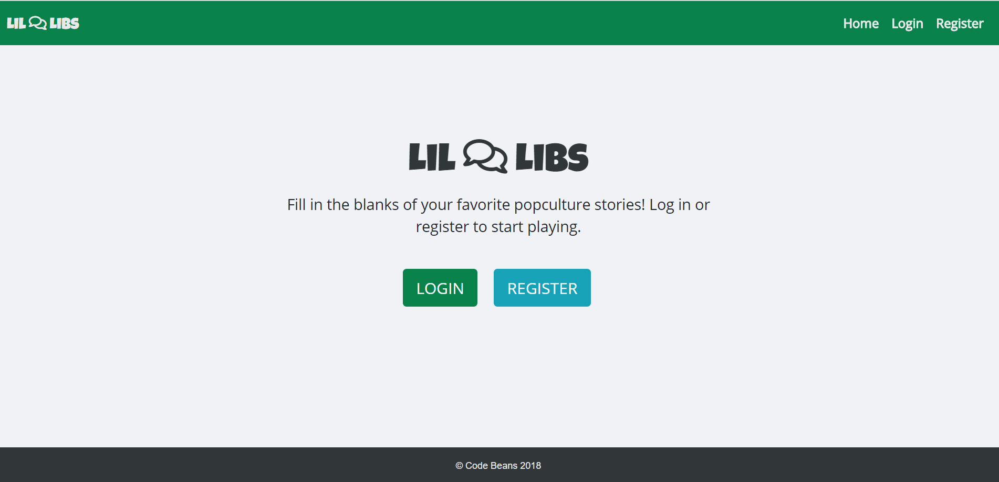

# Req.libs
This is a *Mad Libs* inspired game in which the user picks from one of several categories. The user
is then prompted for verbs, nouns, adverbs, etc. per needed within the story. The paragraph is then combined with the user's input and a story is shown to the user. Stories are saved automatically to the user's profile. The user also has the option to add their own story to the database.

This project's purpose was to, as a team, create a full stack application complete with an express router, a database, and polished UI.

## Getting Started

Click on the link below to play the game.

 

https://req-libs.herokuapp.com/

## Technologies Used

* Handlebars - To display data to the client
* mySQL Workbench - primary sql gui used
* Sequelize - mySQL seeding and queries
* Node.js - server & logic
* Express.js - routing
* Client-side Javascript - To capture and send user input from front end to backend
* Passport - Used to create a local and google Oauth login
* Bcrypt - To hash passwords

 ## Authors

* [Trey Warrick](https://github.com/iQuixotic) - initial setup, webpack research, refactoring, front-end js
* [Benjamin Vaccaro](https://github.com/BenjaminJVaccaro) - database creation, routing, handlebars  
* [Victoria League](https://github.com/vleague2/) - project management, UI, handlebars, refactoring 
* [Alex Trilling](https://github.com/Atrill90) - Authentication 

## The Future of this Project
If we were to do a version 2, we would love to include a multiplayer feature in which stories could be compared and friends could upvote which was the best story. Another multiplayer idea was for friends to take turns filling in blanks on the same story and see what came up. Other future versions may include the ability to limit the visisbility of your user-made stories.

## Acknowledgments

A special thanks to:

* MadLibs - for providing a great source of inspiration to this project
* Trilogy -  for providing useful handlebars reference material 
* John Dinsmore, Mark Powalisz, and Tamara Hall - For helping with general questions, advice, and deployment. 
* Darren Kay - For his help with setting up authentication  

